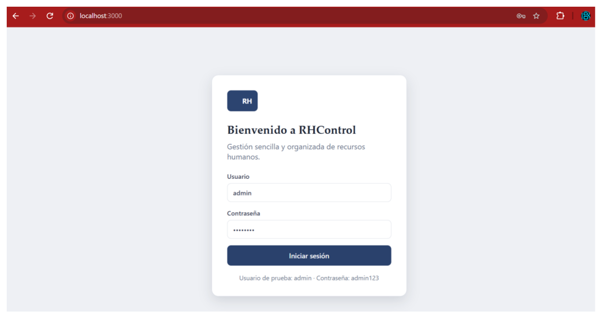
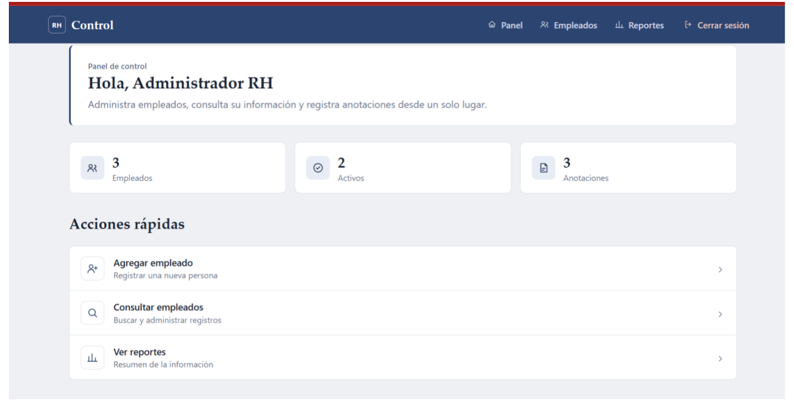
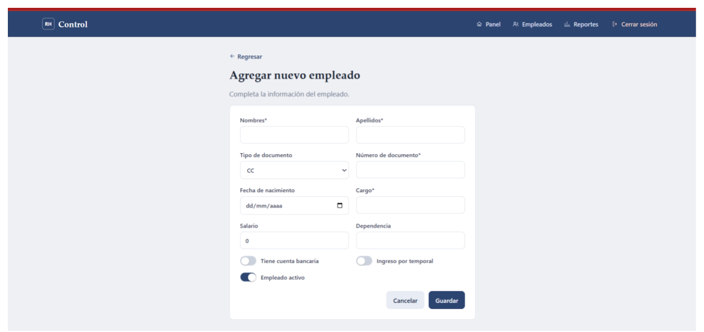
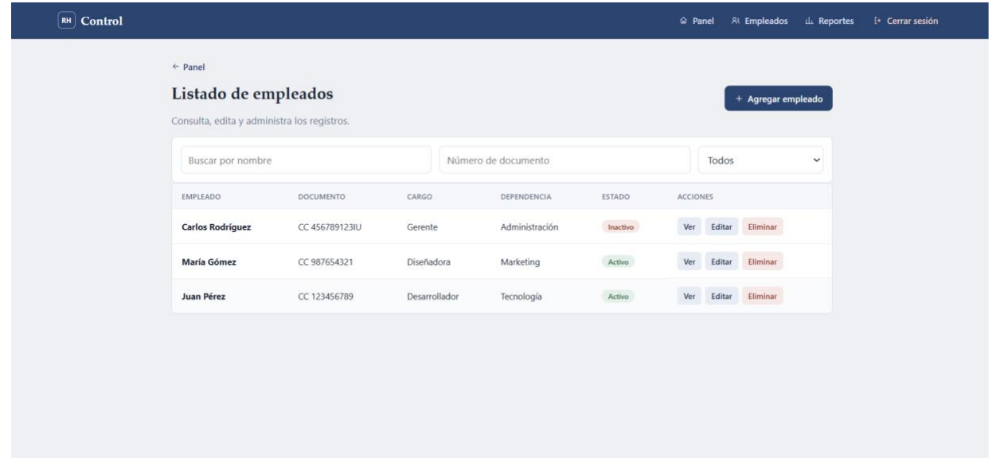
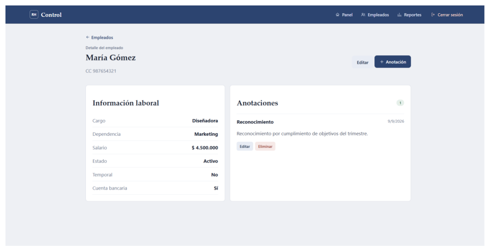
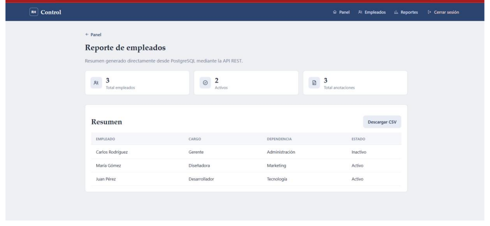

# RHControl 
# RHControl


**RHControl** es una aplicación web para la gestión sencilla y organizada de recursos humanos. Permite administrar el registro de empleados, consultar su información laboral, llevar anotaciones (reconocimientos, observaciones, etc.) y generar reportes con métricas clave, todo desde un panel centralizado.

---

## Tabla de contenido

- [Capturas de pantalla](#capturas-de-pantalla)
- [Características principales](#características-principales)
- [Tecnologías utilizadas](#tecnologías-utilizadas)
- [Estructura del proyecto](#estructura-del-proyecto)
- [Requisitos previos](#requisitos-previos)
- [Instalación y configuración](#instalación-y-configuración)
- [Variables de entorno](#variables-de-entorno)
- [Uso con Docker](#uso-con-docker)
- [Scripts disponibles](#scripts-disponibles)
- [Endpoints principales de la API](#endpoints-principales-de-la-api)
- [Pruebas](#pruebas)
- [Autores](#autores)
- [Licencia](#licencia)

---

## Capturas de pantalla

### Inicio de sesión
Acceso protegido por usuario y contraseña.



### Panel de control
Resumen general del sistema: total de empleados, empleados activos y anotaciones registradas, además de accesos rápidos a las funciones principales.



### Agregar nuevo empleado
Formulario de registro con validación de campos obligatorios (nombres, apellidos, tipo y número de documento, cargo) e información complementaria (salario, dependencia, cuenta bancaria, tipo de ingreso, estado).



### Listado de empleados
Consulta con búsqueda por nombre, por número de documento y filtro por estado, con acciones para ver, editar o eliminar cada registro.



### Detalle del empleado
Ficha individual con la información laboral del empleado y sus anotaciones asociadas (con opción de agregar, editar o eliminar).



### Reporte de empleados
Resumen generado directamente desde PostgreSQL mediante la API REST, con opción de exportar la información a CSV.



---

## Características principales

- Autenticación de usuarios mediante usuario y contraseña.
- Panel de control con indicadores generales (empleados totales, activos y anotaciones).
- Gestión completa (CRUD) de empleados: creación, consulta, edición y eliminación.
- Búsqueda y filtrado de empleados por nombre, número de documento y estado.
- Ficha de detalle por empleado con su información laboral (cargo, dependencia, salario, estado, tipo de ingreso, cuenta bancaria).
- Sistema de anotaciones por empleado, con edición y eliminación individual.
- Módulo de reportes con métricas generales y exportación de datos a CSV.
- Persistencia de datos en PostgreSQL, consumida a través de una API REST.
- Interfaz responsiva construida con React y Tailwind CSS.
- Contenerización del proyecto con Docker y Docker Compose.

---

## Tecnologías utilizadas

### Backend

| Tecnología | Uso |
|---|---|
| Node.js + Express | Servidor y API REST |
| PostgreSQL | Base de datos relacional |
| Arquitectura en capas | Controladores, servicios, modelos, middlewares, rutas y utilidades |
| Docker | Contenerización del servicio |

### Frontend

| Tecnología | Versión | Uso |
|---|---|---|
| React | 19.1.0 | Librería principal de interfaz |
| React DOM | 19.1.0 | Renderizado en el navegador |
| React Router DOM | 7.6.0 | Enrutamiento entre vistas |
| Chart.js / react-chartjs-2 | 4.4.9 / 5.3.0 | Visualización de datos en reportes |
| Tailwind CSS | 4.1.7 | Estilos y diseño responsivo |
| @heroicons/react | 2.2.0 | Iconografía |
| Create React App (react-scripts) | 5.0.1 | Tooling de build y desarrollo |
| Testing Library (dom, jest-dom, react, user-event) | — | Pruebas de componentes |

---

## Estructura del proyecto

```
RHContol/
├── backend/
│   ├── src/
│   │   ├── configuracion/
│   │   │   └── baseDeDatos.js         # Conexión a PostgreSQL
│   │   ├── controladores/
│   │   │   ├── anotacionControlador.js
│   │   │   ├── autenticacionControlador.js
│   │   │   └── empleadoControlador.js
│   │   ├── middlewares/
│   │   ├── modelos/
│   │   ├── rutas/
│   │   ├── servicios/
│   │   └── utilidades/
│   │       ├── manejoErrores.js
│   │       ├── validaciones.js
│   │       └── servidor.js            # Punto de entrada del servidor
│   ├── .gitignore
│   └── Dockerfile
├── frontend/
│   ├── public/
│   └── src/                           # Componentes, páginas y consumo de la API
├── docs/
│   └── screenshots/                   # Capturas usadas en este README
├── docker-compose.yml
├── package.json
└── README.md
```

---

## Requisitos previos

- [Node.js](https://nodejs.org/) 18 o superior
- npm
- [PostgreSQL](https://www.postgresql.org/) 14 o superior (si no se usa Docker)
- [Docker](https://www.docker.com/) y Docker Compose (opcional, recomendado)
- Git

---

## Instalación y configuración

1. **Clonar el repositorio**

```bash
   git clone https://github.com/bdmaderam/RHContol.git
   cd RHContol
```

2. **Configurar el backend**

```bash
   cd backend
   npm install
```

   Crea un archivo `.env` dentro de `backend/` (ver [Variables de entorno](#variables-de-entorno)) y ajusta los datos de conexión a PostgreSQL en `src/configuracion/baseDeDatos.js` según corresponda.

```bash
   node src/utilidades/servidor.js
   # o, si existe un script definido en backend/package.json:
   npm run dev
```

3. **Configurar el frontend**

```bash
   cd ../frontend
   npm install
   npm start
```

   La aplicación quedará disponible por defecto en `http://localhost:3000`.

---

## Variables de entorno

Ejemplo de archivo `.env` para el **backend** (ajusta los nombres exactos según tu configuración en `baseDeDatos.js`):

```env
PORT=4000
DB_HOST=localhost
DB_PORT=5432
DB_USER=postgres
DB_PASSWORD=tu_password
DB_NAME=rhcontrol
JWT_SECRET=tu_clave_secreta
```

Ejemplo de archivo `.env` para el **frontend** (las variables de Create React App deben iniciar con `REACT_APP_`):

```env
REACT_APP_API_URL=http://localhost:4000/api
```

> **Nota:** los archivos `.env` no se versionan (están incluidos en `.gitignore`); cada persona del equipo debe crear el suyo localmente.

---

## Uso con Docker

El proyecto incluye un `docker-compose.yml` en la raíz para levantar los servicios de forma conjunta:

```bash
docker-compose up --build -d
```

Para detener los contenedores:

```bash
docker-compose down
```

---

## Scripts disponibles

**Frontend** (`frontend/package.json`):

| Script | Descripción |
|---|---|
| `npm start` | Ejecuta la aplicación en modo desarrollo |
| `npm run build` | Genera el build de producción |
| `npm test` | Ejecuta las pruebas con Testing Library |
| `npm run eject` | Expone la configuración de Create React App |

**Backend:** revisa `backend/package.json` para los scripts configurados (por ejemplo, un script de desarrollo con recarga automática); el punto de entrada del servidor es `backend/src/utilidades/servidor.js`.

---

## Endpoints principales de la API

Ejemplo de las rutas expuestas para el recurso **empleados** (ajusta el prefijo `/api` según lo definido en `backend/src/rutas`):

| Método | Ruta | Descripción |
|---|---|---|
| `GET` | `/api/empleados` | Obtiene todos los empleados |
| `GET` | `/api/empleados/:id` | Obtiene un empleado por su ID |
| `POST` | `/api/empleados` | Crea un nuevo empleado |
| `PUT` | `/api/empleados/:id` | Actualiza un empleado existente |
| `DELETE` | `/api/empleados/:id` | Elimina un empleado |

El backend expone además módulos de **autenticación** (inicio de sesión) y **anotaciones** (registro de observaciones por empleado), implementados en `autenticacionControlador.js` y `anotacionControlador.js` respectivamente.

---

## Pruebas

El frontend utiliza la suite de **Testing Library** (`@testing-library/dom`, `jest-dom`, `react` y `user-event`) integrada con Create React App:

```bash
cd frontend
npm test
```

---

## Autores

- **Daniel Suárez**
- **Brayan Madera**

---

## Licencia

Este proyecto se distribuye bajo la licencia **ISC**.
